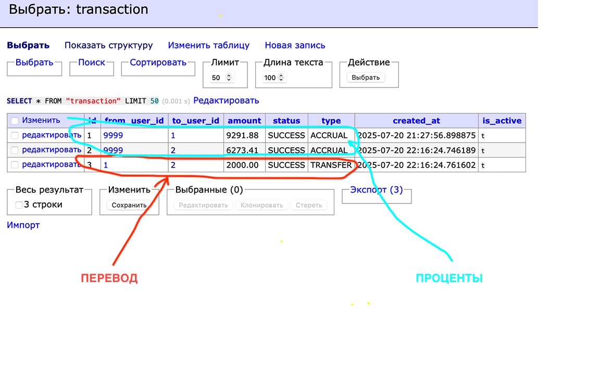
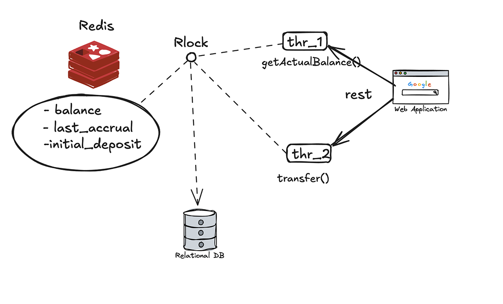

# 💳 Payment System (Test Project)

Проект для демонстрации навыков работы с Spring Boot, PostgreSQL, Redis, Liquibase и архитектурой из 3 слоёв (API,
Service, DAO). Включает работу с пользователями, балансами и транзакциями.
---

## ✅ Описание принципа работы

### - Прогретый кэш

После успешной авторизации пользователя, в Redis добавляется информаця о горячем пользователе:

1) "balance:user:1" - текущий/фактический баланс пользователя
2) "last_accrual:user:1" - дата последнего начисления
3) "initial_deposit:user:1" - изначальный баланс при создании клиента

### - Ленивое начисление

При запросе http://localhost:8080/api/v1/accounts/balance проверяется время последнего начисления депозита, далее оно
сравнивается с текущим временем и делиться на партиции в шаге по 30 секунд. Получившийся elapsed участвует в
формировании суммы начисления, по процентам как итератор/счетчик для суммы в 10% для каждого шага:

#### ((NOW() - LastAccrualTime) / 30 секунд) * 10% от initial_deposit = СУММА ACCRUAL;

После этих вычисления возвращается обновленный баланс, + сохранение его в журнал транзакций transaction и account
обновление баланса
и в redis после успешной транзакции.

Далее если баланс достиг 207% от первоначального депозита, все запросы отрабатывают через кэш для горячих клиентов миную
персистентный слой.
Так же настроен TTL для redis, если get** api не дергается 10 минут данные очищаются те пользователь не активный.

Данный подход будет работать оптимальнее при отсутствии блокировок в БД делая работу более производительной, например
для 1 000 000 счетов.

+ Дешевые операции получения баланса из кэша (Быстрый опрос баланса для клиента).

### - Гибридная модель хранения

Был введен журнал транзакций / начислений. Для точной фикcации проводок и как продолжение например для будующего
расширения функционала -
получение истории операций в мобильном приложении.


---

Схема блокировок:



---

## ⚙️ Как запустить

### 📦 Создание базы данных

Перед запуском приложения необходимо создать базу данных `payment`.

```bash
createdb -U postgres payment
````

## 📦📌 Подключение к БД (Postgres)

```bash
cp .env.example .env
````

### Затем отредактируйте .env под своё окружение

---

## 🧪 Запуск проекта

````markdown
mvn clean package
java -jar ./target/payment-0.0.1-SNAPSHOT.jar
mvn spring-boot:run
````

---

### Документирование open-api

### 👉 [Описание api и моделей](http://localhost:8080/swagger-ui/index.html#/)

---

## 🛠️ Стек технологий

- Java 11
- Spring Boot
- Spring Security (JWT)
- PostgreSQL
- Redis (кэш балансов)
- Liquibase (миграции и начальные данные)
- Maven
- Testcontainers (интеграционные тесты)
- Swagger (OpenAPI 3)

---

## 📦 Архитектура

- `API Layer` — REST-контроллеры
- `Service Layer` — бизнес-логика
- `DAO Layer` — репозитории JPA
- `DTO/Mapper` — передача и преобразование данных
- `Scheduled` — фоновая проверка состояния балансов
- `Redis` — временное хранение активных балансов

---

## 📄 Основной функционал

- 🔐 Аутентификация по email/phone + password (JWT)
- 🔍 Поиск пользователей по `email`, `phone`, `name`, `dateOfBirth` с пагинацией
- ✏️ Обновление email/phone только для себя
- 💰 Трансфер средств между пользователями
- 📈 Автоначисление процентов к балансу (до 207% от начального депозита)
- 🧾 История транзакций

---

## 🧪 Тесты

- ✅ Юнит-тесты для логики перевода
- ✅ Интеграционные тесты через Testcontainers + MockMvc

---